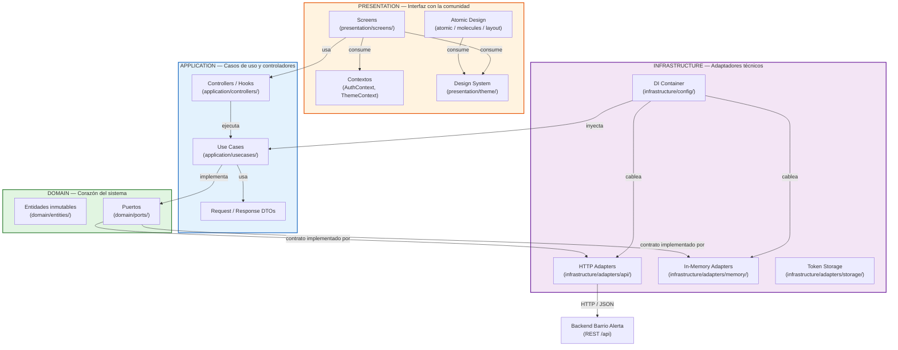
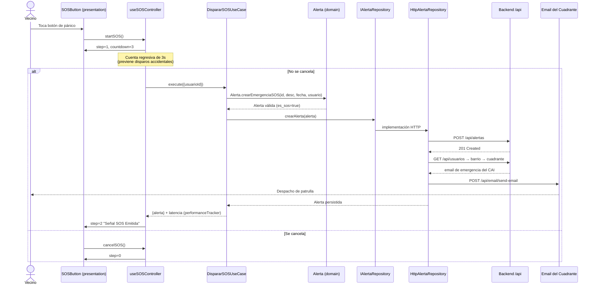
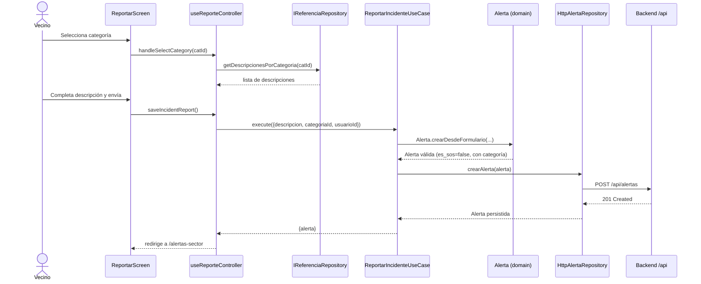
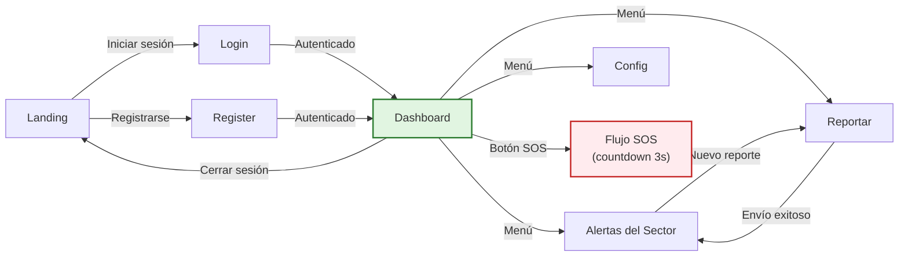
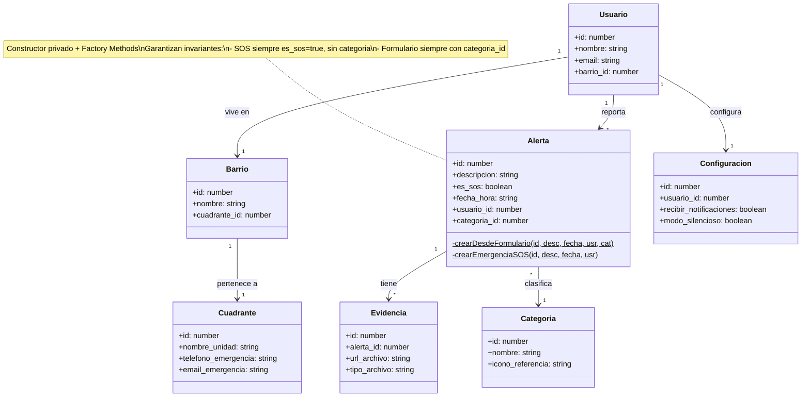

# Barrio Alerta — Frontend

Cliente móvil multiplataforma del sistema de alertas vecinales para la seguridad comunitaria. Un frontend diseñado con conciencia social y ambiental, priorizando el bienestar de las comunidades sobre lógicas extractivistas.

---

## Propósito y contexto

Barrio Alerta nace de una necesidad real: **la seguridad ciudadana no puede ser un privilegio**. En comunidades donde la respuesta institucional es limitada, la solidaridad vecinal es el recurso más valioso. Este cliente permite a cualquier persona, desde un teléfono, reportar incidentes en tiempo real, activar alertas S.O.S. con un solo toque y coordinar la respuesta comunitaria con su barrio y el CAI de su cuadrante policial.

El software no extrae datos para fines comerciales, no perfila usuarios, no vende atención, no muestra publicidad. Es una herramienta al servicio de la comunidad, diseñada para minimizar su huella ecológica y maximizar su utilidad social.

---

## Arquitectura



### Flujo de una alerta S.O.S.



### Flujo de reporte de incidente



### Principios de diseño

| Principio | Implementación |
|-----------|----------------|
| **Modularidad** | Cuatro capas con responsabilidades claras y dependencias unidireccionales. El dominio no sabe de React, ni de HTTP, ni de Axios. |
| **Bajo acoplamiento** | Las capas se comunican mediante interfaces (puertos). Cambiar el adaptador HTTP por In-Memory no afecta al dominio ni a los casos de uso. |
| **Alta cohesión** | Cada capa hace una sola cosa: el dominio modela, la aplicación orquesta, la infraestructura implementa tecnología, la presentación pinta. |
| **Inversión de dependencias** | Los casos de uso dependen de `IAlertaRepository`, no de `HttpAlertaRepository`. El flujo de control va hacia adentro. |
| **Sustitución Liskov** | Los adaptadores `InMemory*` y `Http*` son intercambiables en runtime porque respetan el mismo contrato. |
| **Testabilidad** | Toda la lógica de negocio se invierte contra interfaces, lo que permite testear los UseCases sin React ni red. |

### Estructura de carpetas

```
src/
├── domain/                              # Corazón del sistema (sin dependencias externas)
│   ├── entities/                        # Entidades inmutables con factory methods
│   │   ├── alerta.ts                    #   Alerta con constructor privado + 2 factories
│   │   ├── barrio.ts                    #   Barrio de la comunidad
│   │   ├── categoria.ts                 #   Categoría de incidente
│   │   ├── categoriaDescripcion.ts      #   Descripción predefinida por categoría
│   │   ├── configuracion.ts             #   Preferencias de notificación del usuario
│   │   ├── cuadrante.ts                 #   CAI policial con contacto de emergencia
│   │   ├── evidencia.ts                 #   Evidencia (imagen) de una alerta
│   │   ├── sesion.ts                    #   DTO de sesión autenticada
│   │   └── usuario.ts                   #   Vecino registrado
│   └── ports/                           # Contratos (interfaces) del dominio
│       ├── IAlertaRepository.ts         #   Puerto de salida: alertas y evidencias
│       ├── IAuthRepository.ts           #   Puerto de salida: autenticación
│       ├── IConfiguracionRepository.ts   #   Puerto de salida: configuración
│       └── IReferenciaRepository.ts     #   Puerto de salida: barrios, categorías, usuarios
├── application/                         # Casos de uso y controladores
│   ├── controllers/                     # Hooks que puentean React ↔ UseCases
│   │   ├── useDashboardController.ts
│   │   ├── useReporteController.ts
│   │   ├── useSectorAlertsController.ts
│   │   ├── useSOSController.ts          #   Máquina de estados finita (3 pasos + countdown)
│   │   └── useConfiguracionController.ts
│   └── usecases/                        # Lógica de negocio orquestada
│       ├── DispararSOSUseCase.ts
│       ├── ObtenerAlertasUseCase.ts     #   Filtra por config, ordena y enriquece en paralelo
│       ├── ReportarIncidenteUseCase.ts
│       └── ActualizarConfiguracionUseCase.ts
├── infrastructure/                      # Implementaciones técnicas
│   ├── adapters/
│   │   ├── api/                         # Adaptadores HTTP (Axios)
│   │   │   ├── HttpAlertaRepository.ts  #   Incluye fallback de email si falla el POST
│   │   │   ├── HttpAuthRepository.ts
│   │   │   ├── HttpConfiguracionRepository.ts
│   │   │   ├── ApiReferenciaRepository.ts
│   │   │   └── HttpGenericService.ts    #   Singleton de Axios + interceptor de token
│   │   ├── memory/                      # Adaptadores In-Memory (sin backend)
│   │   │   ├── InMemoryAlertaRepository.ts
│   │   │   ├── InMemoryAuthRepository.ts
│   │   │   ├── InMemoryConfiguracionRepository.ts
│   │   │   └── InMemoryReferenciaRepository.ts
│   │   └── storage/
│   │       └── TokenStorage.ts          #   Async Storage del JWT
│   ├── config/
│   │   └── dependencyContainer.ts       #   DI Container (Singleton) — cablea adaptadores
│   └── presets/
│       └── reportePresets.ts
├── presentation/                        # Interfaz con la comunidad
│   ├── components/
│   │   ├── atomic/                      # Icon, CategoryButton, SectionBadge, ToggleSwitch
│   │   ├── molecules/                   # AlertCard, SOSButton, DescriptionSelector, EvidenceCapture
│   │   └── layout/                      # Header, SectionCard, SVGBackground
│   ├── context/
│   │   └── AuthContext.tsx             # Sesión, barrio, cuadrante, configuración
│   ├── screens/                         # Dashboard, Login, Register, Reportar, Config, SectorAlerts
│   ├── theme/                           # Design system tematizable
│   │   ├── types.ts                     #   AppTheme (colores + spacing)
│   │   ├── lightTheme.ts
│   │   ├── darkTheme.ts
│   │   └── ThemeContext.tsx
│   └── constants/
├── app/                                 # Expo Router (file-based routing)
│   ├── _layout.tsx                      # Layout raíz: auth gate + drawer menu animado
│   ├── index.tsx                        # Dashboard
│   ├── alertas-sector.tsx               # Alertas del sector
│   ├── reportar.tsx                     # Reporte de incidente
│   └── config.tsx                       # Configuración de notificaciones
└── constants/
    └── env.ts                           # Selección de adaptador (memory | api) en runtime
```

---

## Decisiones de diseño consciente

### Eficiencia algorítmica y almacenamiento responsable

- **Entidades inmutables con campos `readonly`**: `Alerta`, `Usuario`, `Configuracion` y compañía son clases con todos sus campos públicos de solo lectura. Cero mutación accidental del estado de dominio, cero efectos secundarios.
- **Factory Methods en `Alerta`**: el constructor es privado y existen dos fábricas (`crearDesdeFormulario`, `crearEmergenciaSOS`) que garantizan invariantes — no existe una `Alerta` SOS sin `es_sos=true`, ni una alerta de formulario sin `categoria_id`. El estado inválido no se puede construir.
- **Mapeo DTO ↔ Entidad en el adaptador**: la hidratación de `Alerta` desde el JSON del backend vive en `HttpAlertaRepository`, no se filtra al dominio ni al caso de uso. El dominio habla su propio lenguaje.
- **Adaptador In-Memory para desarrollo**: cero peticiones de red mientras se itera localmente, menor consumo de energía y ancho de banda durante el desarrollo. La misma base de código funciona completa sin backend.

### Bajo consumo de recursos

- **`Promise.all` en casos de uso**: `ObtenerAlertasUseCase` y `useSectorAlertsController` paralelizan 2-3 llamadas independientes en lugar de secuenciarlas — menos tiempo de CPU/radio activa en el móvil.
- **Singleton de Axios**: `HttpGenericService` crea una sola `AxiosInstance` reutilizada en toda la app — evita el overhead de crear conexiones repetidas.
- **Animaciones en hilo nativo**: el drawer menu y las transiciones usan `useNativeDriver: true` — no bloquean el hilo de JavaScript, reduciendo el consumo de CPU.
- **`useCallback` y `useEffect` con limpieza**: los controladores memizan funciones y limpian suscripciones, previniendo renders fantasma y fugas de memoria.
- **Componentes estilizados vía `getStyles(theme)`**: una sola definición de `StyleSheet` por componente, cacheada por tema — sin estilos inline recreados en cada render.

### Gestión de datos en tiempo real

- **Botón de pánico con confirmación y countdown**: el `useSOSController` implementa una **máquina de estados finita de 3 pasos** (`idle → confirmar → activo`) con cuenta regresiva de 3 segundos. Reduce falsos positivos — una buena decisión técnica al servicio de no saturar al cuerpo policial con alertas accidentales.
- **Observabilidad del path crítico**: `performanceTracker` mide la latencia real del flujo SOS (`Date.now() - start`) — no es vanity metric, es telemetría del flujo más sensible para optimizarlo.
- **Fallback de notificación por email**: si el POST de alerta al backend falla y era SOS, el adaptador HTTP cae a un path de email directo al cuadrante. La emergencia no se pierde por un fallo de red.
- **Filtrado y ordenamiento en el caso de uso**: `ObtenerAlertasUseCase` aplica las reglas del dominio (modo silencioso, notificaciones desactivadas, SOS siempre visible) y ordena por fecha — el backend entrega datos crudos, el cliente aplica la lógica de visualización de la comunidad.

### Justicia distributiva y bienestar socioambiental

- **Sin fines comerciales**: el sistema no recopila datos de comportamiento, no muestra publicidad, no vende información, no usa SDKs de analítica de terceros. El token JWT se guarda localmente y no se comparte. Cada alerta es un acto de solidaridad, no un producto.
- **Democratiza el acceso a la seguridad**: cualquier vecino con un teléfono puede disparar una alerta SOS que llega al CAI de su cuadrante, sin filtros económicos ni institucionales intermediarios.
- **Descentraliza la vigilancia**: cualquier residente registrado puede reportar incidentes y toda su comunidad vecinal los ve en tiempo real en `/alertas-sector`.
- **Modo silencioso**: respeta el derecho del usuario a no recibir ruido constante — la app no impone una atención permanente, la persona decide su nivel de involucramiento. Es diseño consciente del bienestar, frente a la lógica extractivista de la economía de la atención.
- **Accesible**: cliente móvil multiplataforma (Android, iOS, web) construido sobre React Native + Expo — cualquier dispositivo de bajo costo puede ejecutarlo. No se requiere hardware especializado.
- **Comunitario**: el modelo de datos refleja la estructura de una comunidad real: barrios, cuadrantes de emergencia con su email de contacto, configuraciones de notificación por usuario. El software se adapta a la comunidad, no al revés.
- **Transparente**: el código es abierto, documentado y ejecutable. Cualquier comunidad puede auditar, modificar o desplegar su propia instancia.

---

## Cómo ejecutar

### Requisitos mínimos

- Node.js 18+
- npm o pnpm
- Un dispositivo móvil con Expo Go, un emulador Android/iOS, o un navegador

### Modo desarrollo (sin backend)

El frontend funciona completo con datos en memoria. No requiere backend, ni internet, ni Docker:

```bash
npm install
npm start
```

Al escanear el QR con Expo Go o abrir en un emulador, la app usa los adaptadores `InMemory*` automáticamente.

### Modo integrado (con backend)

Define la URL del backend y la app conmutará a los adaptadores HTTP:

```bash
# .env
EXPO_PUBLIC_API_URL=http://localhost:8080

npm start
```

La selección del adaptador ocurre en `src/constants/env.ts` en runtime, sin recompilar.

### Scripts disponibles

| Script | Propósito |
|--------|-----------|
| `npm start` | Inicia Expo Dev Server |
| `npm run android` | Abre en emulador Android |
| `npm run ios` | Abre en simulador iOS |
| `npm run web` | Abre en navegador |
| `npm run lint` | ESLint con `eslint-config-expo` |
| `npm run reset-project` | Reinicia la plantilla (uso interno) |

---

## Pantallas y flujos



| Pantalla | Propósito |
|----------|-----------|
| **Landing** | Presentación del proyecto a la comunidad |
| **Login / Register** | Autenticación comunitaria con selección de barrio |
| **Dashboard** | Resumen del usuario, barrio, cuadrante y botón de pánico |
| **Alertas del Sector** | Feed en tiempo real de incidentes del barrio, con filtro por fecha |
| **Reportar** | Formulario guiado por categorías y descripciones predefinidas |
| **Configuración** | Modo silencioso y notificaciones selectivas |

---

## Tecnologías

| Componente | Tecnología | ¿Por qué? |
|------------|-----------|-----------|
| Plataforma | Expo SDK 56 + React Native 0.85 | Multiplataforma (Android, iOS, web) con un solo código |
| Lenguaje | TypeScript estricto | Seguridad de tipos end-to-end, 32 interfaces, 565 símbolos |
| Routing | Expo Router | File-based routing, navegación tipada |
| Networking | Axios | Interceptor de token, singleton, manejo de errores con `isAxiosError` |
| Persistencia local | Async Storage | Almacenamiento seguro del JWT en el dispositivo |
| Animación | Reanimated 4 + worklets | Transiciones fluidas en hilo nativo, sin bloquear JS |
| Iconografía | lucide-react-native | Iconos semánticos, consistentes, ligeros |
| Theme | Design system propio | Light/Dark theme tipado, conmutable en runtime |

---

## Modelo de dominio



---

## Licencia

Código abierto. Construido para comunidades, no para mercados.